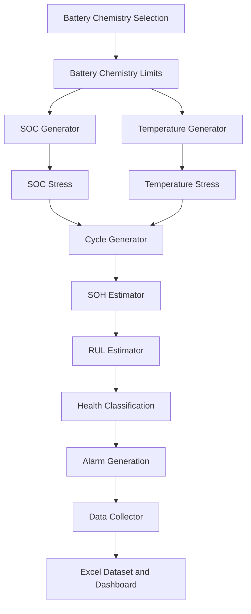

# EV Battery Health Predictor

A smart EV battery health monitoring, prediction and visualization system developed using MATLAB, Simulink, Java and a web-based dashboard.

The system analyzes battery operating parameters and estimates:

- State of Health — SOH
- Remaining Useful Life — RUL
- Battery health status
- Battery alarm condition

It supports three lithium-ion battery chemistries:

- Lithium Iron Phosphate — LFP
- Nickel Manganese Cobalt — NMC
- Nickel Cobalt Aluminium — NCA

---

## Project Overview

Electric vehicle performance, safety, efficiency and driving range depend heavily on the condition of the battery.

EV batteries gradually degrade because of factors such as:

- High operating temperature
- Deep charging and discharging
- State-of-charge limits
- Number of battery cycles
- Battery operating time
- Battery chemistry
- Repeated thermal and electrical stress

This project develops a data-driven battery monitoring and prediction system.

MATLAB and Simulink are used to simulate battery operating conditions and generate a structured dataset. The generated data is then used to calculate battery health indicators such as SOH, RUL, health status and alarm condition.

A web-based dashboard displays the battery parameters and allows users to compare the performance of LFP, NMC and NCA battery chemistries.

The project can support:

- Predictive battery maintenance
- Battery degradation analysis
- Early fault identification
- Battery replacement planning
- Battery chemistry comparison
- EV battery lifecycle management

---

## Project Objectives

The main objectives of this project are:

1. Monitor important EV battery parameters.
2. Generate realistic battery operating data using MATLAB and Simulink.
3. Estimate the State of Health of the battery.
4. Predict the Remaining Useful Life of the battery.
5. Classify the battery condition as Good, Warning or End of Life.
6. Generate alarms when the battery operates outside safe limits.
7. Compare LFP, NMC and NCA battery chemistries.
8. Export the generated data into an Excel dataset.
9. Display the battery information through a user-friendly dashboard.
10. Prepare a structured dataset for future machine-learning applications.

---

## Main Features

- Supports LFP, NMC and NCA batteries
- Battery chemistry selection
- Battery chemistry-specific operating limits
- State-of-Charge generation
- SOC stress calculation
- Average temperature monitoring
- Maximum temperature monitoring
- Thermal stress calculation
- Battery cycle-count generation
- State-of-Health estimation
- Remaining Useful Life estimation
- Battery health classification
- Battery alarm generation
- Simulink-based dataset generation
- Excel dataset export
- Web-based dashboard
- Battery degradation visualization
- Battery chemistry comparison
- Predictive-maintenance support
- Machine-learning-ready dataset

---

## System Workflow

The complete project follows this process:

1. Select the required battery chemistry.
2. Load the operating limits for the selected chemistry.
3. Generate battery SOC values.
4. Compare SOC values with the recommended limits.
5. Calculate SOC-related battery stress.
6. Generate average and maximum battery temperature.
7. Calculate temperature-related stress.
8. Generate the battery cycle count.
9. Estimate battery degradation.
10. Calculate the State of Health.
11. Estimate the Remaining Useful Life.
12. Classify the battery health.
13. Generate warning and alarm signals.
14. Collect all battery parameters.
15. Export the results into an Excel dataset.
16. Display the results through the battery analytics dashboard.

---

## System Architecture



---

## Battery Parameters

The system processes the following battery parameters:
<div align="center">
    
| Parameter | Description |
|:---:|:---:|
| Chemistry ID | Numerical identification of the battery chemistry |
| Chemistry Name | LFP, NMC or NCA |
| SOC Minimum | Minimum State-of-Charge operating value |
| SOC Maximum | Maximum State-of-Charge operating value |
| Average Temperature | Average battery operating temperature |
| Maximum Temperature | Highest battery operating temperature |
| Cycle Count | Number of charge and discharge cycles |
| SOC Stress | Stress caused by operation outside the recommended SOC limits |
| Temperature Stress | Stress caused by high or abnormal temperature |
| SOH | Current usable battery capacity compared with its original condition |
| RUL | Estimated remaining useful battery life |
| Health Status | Good, Warning or End of Life |
| Alarm Status | Indicates an abnormal or unsafe operating condition |
</div>

---

## Battery Chemistry Specifications

### Lithium Iron Phosphate — LFP
<div align="center">
    
| Parameter | Recommended Range |
|:---:|:---:|
| Chemistry ID | 1 |
| Minimum SOC | Approximately 10% to 20% |
| Maximum SOC | Approximately 90% to 100% |
| Average Temperature | Approximately 10°C to 35°C |
| Maximum Temperature | Approximately 45°C to 50°C |
| Expected Cycle Life | Approximately 3,000 to 7,000+ cycles |
</div>

### Nickel Manganese Cobalt — NMC
<div align="center">
    
| Parameter | Recommended Range |
|:---:|:---:|
| Chemistry ID | 2 |
| Minimum SOC | Approximately 20% |
| Maximum SOC | Approximately 80% to 90% |
| Average Temperature | Approximately 15°C to 35°C |
| Maximum Temperature | Approximately 45°C to 50°C |
| Expected Cycle Life | Approximately 1,000 to 2,000 cycles |
</div>

### Nickel Cobalt Aluminium — NCA
<div align="center">
    
| Parameter | Recommended Range |
|:---:|:---:|
| Chemistry ID | 3 |
| Minimum SOC | Approximately 20% |
| Maximum SOC | Approximately 80% to 90% |
| Average Temperature | Approximately 20°C to 35°C |
| Maximum Temperature | Approximately 45°C to 50°C |
| Expected Cycle Life | Approximately 500 to 1,500 cycles |
</div>

---

## State of Health

State of Health represents the present usable battery capacity compared with the battery's original capacity.

A higher SOH indicates a healthier battery, while a lower SOH indicates greater battery degradation.

The SOH estimator uses inputs such as:

- Battery chemistry
- SOC stress
- Temperature stress
- Battery cycle count
- Battery degradation constants

The estimated SOH is presented as a percentage.

---

## SOH Classification

The project classifies battery health using the following limits:
<div align="center">
    
| SOH Value | Battery Status |
|:---:|:---:|
| Above 80% | Good |
| 70% to 80% | Warning |
| Below 70% | End of Life |
</div>

The classification helps users understand the battery condition without requiring detailed technical knowledge.

---

## Remaining Useful Life

Remaining Useful Life estimates how long the battery can continue operating before reaching the end of its effective lifetime.

The RUL estimator considers:

- Current SOH
- Battery chemistry
- Total expected battery cycle life
- Current cycle count
- Temperature conditions
- Remaining cycle factor
- Chemistry-specific nominal life

RUL prediction can help users:

- Plan battery maintenance
- Schedule battery replacement
- Reduce unexpected battery failure
- Improve battery reliability
- Reduce vehicle downtime

---

## Alarm Generation

The alarm generator continuously checks important battery parameters.

An alarm may be generated when:

- SOH falls below the permitted value
- SOC exceeds the recommended limits
- Battery temperature exceeds the safe limit
- Battery health reaches the Warning condition
- Battery health reaches End of Life
- Other abnormal operating conditions are detected

The alarm system supports early warning and preventive maintenance.

---

## Dataset Generation

The battery dataset is generated using MATLAB and Simulink.

The model generates approximately 25,000 simulation samples with different:

- Battery chemistries
- SOC conditions
- Temperature conditions
- Battery cycle counts
- SOH values
- RUL values
- Health classifications
- Alarm conditions

The generated data is exported into Microsoft Excel.

Dataset location:

```text
Dataset/Battery_Dataset.xlsx
```

The dataset contains columns such as:

```text
Chemistry_ID
Chemistry_Name
SOC_Min_Low
SOC_Max_High
AvgTemp
MaxTemp
Cycles
SOH
Health_Status_Code
Health_Status
RUL
Alarm_Final
```

The dataset can be used for:

- Battery health prediction
- Machine-learning training
- Battery classification
- Degradation analysis
- SOH prediction
- RUL prediction
- Predictive-maintenance research

---

## Machine-Learning Approach

The project documentation demonstrates a Random Forest and decision-tree-based classification approach.

The main input parameters used for classification include:

- Average SOC
- Battery temperature
- Battery cycle count

The target classes are:
<div align="center">
    
| Class Code | Battery Condition |
|:---:|:---:|
| 1 | Good |
| 2 | Warning |
| 3 | End of Life |
</div>

Decision-tree split calculations are demonstrated using Mean Squared Error and sample battery data.

The current system provides a structured foundation for the future development of a complete trained and validated machine-learning model.

---

## Web Dashboard

The EV Battery Analytics Dashboard displays battery information for LFP, NMC and NCA chemistries.

The dashboard displays:

- State of Health
- Remaining Useful Life
- Battery health status
- Battery chemistry
- Temperature values
- Battery cycle count
- Degradation trend
- Warning status
- Alarm condition
- Chemistry comparison
- SOH calculator

The dashboard converts complex battery information into understandable numerical values, indicators and graphs.

---

## Technologies Used
<div align="center">
    
| Technology | Purpose |
|:---:|:---:|
| MATLAB | Battery calculations and data processing |
| Simulink | Battery-condition simulation and dataset generation |
| Microsoft Excel | Dataset storage and analysis |
| Java | Web application and backend development |
| Gradle | Project build and dependency management |
| HTML | Dashboard page structure |
| CSS | Dashboard styling |
| Random Forest | Battery-health classification concept |
| Decision Tree | Battery-status prediction and manual calculation |
</div>

---
